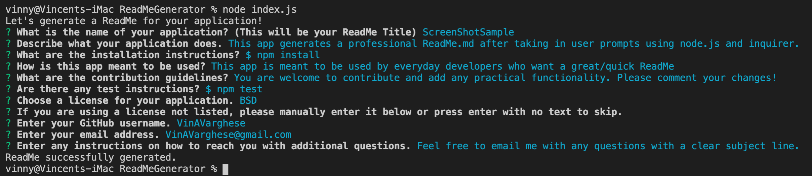
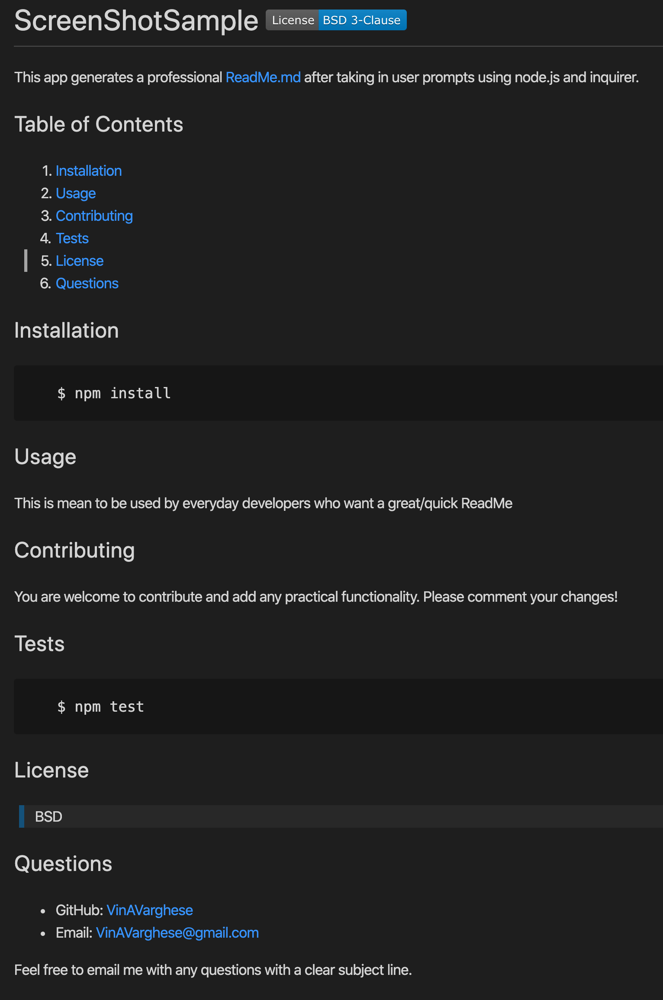

# ReadMeGenerator 
  This is a node.js application that helps developers create professional README markdowns for their applications. Using Iquirer, the generator uses answers to prompts to create a README with ease so developers can focus on what matters most! Enjoy the application and please contribute if you believe there is a feature that can be useful to the everyday dev. 
  ## Table of Contents
  1. [Installation](#Installation)
  2. [Usage](#Usage)
  3. [Contributing](#Contributing)
  4. [Tests](#Tests)
  5. [License](#License)
  6. [Questions](#Questions)
  ## Installation
       $ npm install 
  ## Usage
  This app is meant to be used on a regular basis for any/every project a developer may be working on. It cuts down the time taken to create a README.md, so can be used at the end of a project to describe it, explain any technical specs/instructions and welcome contribution. 
  ## Contributing
  Be sure to comment in changes and test often! Other than that, have it! 
  ## Tests
      There are no automated tests for this application but be sure to test every step of the way when contributing.
  ## License
  >MIT
  ## Questions

  * GitHub: [VinAVarghese](https://github.com/VinAVarghese)
  * Email: [VinAVarghese@gmail.com](mailto:VinAVarghese@gmail.com)
  
  If you have any questions, feel free to email me with a subjuct line of "Question RE: (application name)". Thank you!
  ## Links/Images
  [Example Video](https://drive.google.com/file/d/1Jt6jV3l6SI4-qv_TAgAyZ9IRc-cZKz-P/view) 
  
  
